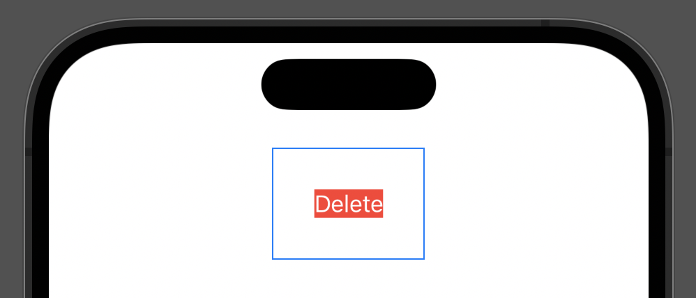

## Part 2: Short answer questions


a) Question: Describe the two size classes in iOS.

- Answer: The two size classes are `InterfaceSizeClass.regular` and `InterfaceSizeClass.compact`.
  - You recieve a size class value when you read either the `horizontalSizeClass` or `verticalSizeClass` environment values.
  - These values tell you the amount of space available to your views in a given direction.  You can use this information to adapt your user interface intelligently based on the available space.
  - You can read the size class like any other Environment Value, by creating a property with the Environment property wrapper: 
    - `@Environment(\.verticalSizeClass) var verticalSizeClass`
    - `@Environment(\.horizontalSizeClass) var horizontalSizeClass`


b) Question: What is Continuous Learning, and why is it important in mobile development?

- Answer: Continuous learning is the process of constantly acquiring new knowledge and skills to enhance your personal & professional growth.
  - It's important in mobile development because the dev tools and frameworks provided by Apple, or Google, will change over time and continuous learning helps you stay current with knowledge.


c) Question: How can you find out what modifiers a View has?

- Answer: In Xcode if you click on the Library button, which is represented as a "+", there is a Views section that show the modifiers that can be applied to the View.


d) Question: What is a breakpoint?

- Answer: A breakpoint is a debugging option to pause code execution on a certain line.
  - In Xcode, you can click on the line number in the editor to set a breakpoint. A blue icon will appear on the line when it's set.
  - When the code execution stops at the breakpoint, you can inspect the variable values  or step through your code to troubleshoot and debug.


e) Question: How can you access environment values in your App? 

- Answer: To access an environment value, you can create an `@Environment` property variable specifying the key path to the value. The format is:

  - ```
    @Environment(\.keyPath) var propertyName
    ```

  - A `keyPath` is a special name defined by Apple for each environment property that’s available.

    - For example: the `keyPath`  to tell you whether the app is in light or dark mode is `\.colorScheme `


f) Question: How can you determine, in code, if the App is in Dark or Light Mode?

- Answer: You can create an `@Environment` property variable for `colorScheme` and then check to see if the property variable is equal to `ColorScheme.dark` or `ColorScheme.light`.

  - To create the environment variable, you will set the `keyPath` to `\.colorScheme`:

  - ```
    @Environment(\.colorScheme) var colorScheme
    ```


g) Question: Why are magic numbers an issue, and how should you avoid them?

- Answer: Magic numbers are an issue because from looking at them its unclear where the number came from or what it refers to. Furthermore, if we need to change the number value, when refactoring code, it becomes a manual process of searching for the number and changing it for all occurrences.

  - Instead of using magic numbers, it's better to use named constants. For example, we could create an Enum that contains static properties to organize and group our constant values.

  

h) Question: How can you view your App in Light and Dark Modes simultaneously?

- Answer: In the PreviewProvider struct for your SwiftUI class, you can create another instance of the view struct with the `.preferredColorScheme(.dark)` modifier


i) Question: Below is an image of the Canvas from Xcode. The Canvas is in selectable mode. Can you explain why the red background does not cover the entire button area?



- Answer: The red background does not cover the entire button area due to the order of the view modifiers that are applied to the button. Specifically, the `.padding()` view modifier is being applied as the last view modifier. Padding takes the original view, adds transparent space around the edges, and returns a new bigger view. To make the red background color apply throughout the entire area, we would need to apply the padding before we set the red background color.


j) Question Modifier padding(10) adds padding to the view's top, bottom, left, and right sides. How could a padding of 10 be added to only the left and right sides of the view?

- Answer: There are two ways we could do this:

```
// Add leading and trailing padding of 10
.padding([.leading, .trailing], 10) 

// Or

// Add horizontal padding of 10
.padding(.horizontal, 10) 
```

- Both will add padding to the leading (left) and trailing (right) sides of the view, while leaving the top and bottom padding unaffected.


k) Question: Provide two reasons why you would want to extract views.

- Answer: One reason to extract views is to make them resuable in other places in the app. Another reason to extract views would be to make your code more maintainable, otherwise the body of the view could become very long.


l) Question: How can you determine, in code, if the device is in Portrait or Landscape mode?

- Answer: You can check the values for the `verticalSizeClass` and `horizontalSizeClass` to see whether the device is in Portrait or Landscape mode. Specifically if the size classes match the following values noted on the Device size classes on the Apple Human Interface Guidelines - Layout section of their website:
  https://developer.apple.com/design/human-interface-guidelines/layout#Specifications


m) Question: What is a literal value?

- Answer: Values that are not computed or derived. Literal values can be used for intitalizing variables and defining constants. For example, a string literal is a sequence of characters enclosed in double quotes.


o) Question: What are the safe areas?

- Answer: The safe areas are parts of the view, such as the notch area or bottom home indicator, that Apple prevents you from covering by default. However we can have views that extend into the safe area by using the modifier `.ignoresSafeArea()`.


p) Question: This line of code was in the lesson on animation. Can you state in English what the line means?

```
.frame(width: wideShapes ? 200 : 100)
```

- Answer: `wideShapes` was a state variable boolean for keeping track of whether we are, or are not, showing wide shapes. If `wideShapes` is `true`, then the view's width will be 200 points. If `wideShapes` is false, then the view's width will be 100 points. This allows for the view's width to be dynamically sized based on the state of `wideShapes`.


q) Question: Describe the two transitions you were introduced to in this week’s lesson.

- Answer: We were introduced to `.scale` and `.opacity`.


r) Question: In Bullseye, the `Game` struct is what type of object? 

- Answer: The `Game` struct is a custom object we defined to represet the features of the bullsye game. It has stored properties and methods to faciltate key game actions like calculating points, starting a new round, and adding a score to the leaderboard.


s) Question: What are SFSymbols?

- Answer: A collection of iconography that Apple has created that we can use as an image in our app.


t) Question: What is the difference between “step into” and “step over " in the debugger?”

- Answer:
  - "Step into" will move to the next line of code and if that line contains a function call, it will enter into that function, allowing you to step through the function's code line by line.
    - This is useful when you want to dive into the details of a function's implementation and inspect its behavior.
  - On the other hand, "step over" will move onto the next line of code, without entering into any functions that are called on that line. To clarify, if the next line contains a function call, the function will be executed in its entirety, but the debugger will not step into it. Instead, it will move to the next line after the function call.
    - This is useful when you are not interested in stepping through the details of a function and just want to execute it and move on to the next line of code.


u) Question: Name some items you would place in the Asset Catalog 

- Answer: Some items you would place in the Assets catalog include colors, icons, and images.


v) Question: How do you change the Display Name of your app?

- Answer: In your project settings, first select your app target. In the "General" tab, there will be an "Identity" section with an input field for entering the Display Name.