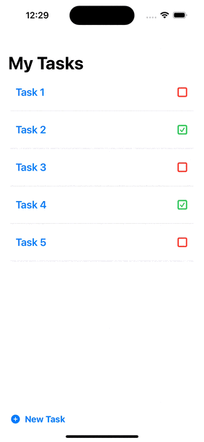

# My Tasks App

The My Tasks app helps organize your tasks efficiently. It allows you to add, view details, mark completion status, and edit tasks seamlessly.

## Features

- **Task List**: View all your tasks with title and status.
- **Task Details**: Access detailed information for each task, including notes and completion status.
- **Add New Task**: Quickly add new tasks with titles and optional notes.
- **Edit Tasks**: Modify task titles, notes, and completion status.
- **Toggle Completion**: Mark tasks as completed or pending with a simple toggle.

## Preview

## Installation

To run the My Tasks app:

1. Clone the repository.
2. Open the project in Xcode.
3. Build and run the project on a simulator or physical device.

## Usage

1. **Task List Screen**:
   - View all tasks organized by title.
   - Tap on a task to view its details.
2. **Task Detail Screen**:
   - Edit task title and notes.
   - Toggle task completion status.
3. **Adding a New Task**:
   - Press the "New Task" button to add a new task.
   - Enter a title and optional notes, then press "Add".
4. **Editing a Task**:
   - Tap on a task to view its details.
   - Modify the title, notes, or completion status as needed.
5. **Toggle Completion**:
   - In the task detail view, toggle the completion switch to mark the task as completed or pending.