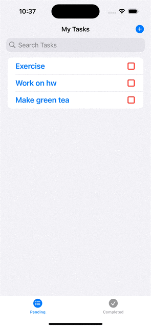

## Part 1 - Short answer questions

a) Question: In SwiftUI, you describe your interfaces _____________ and leave the ___________ to the Framework.

- Answer: you describe your interfaces **declaratively** and leave the **implementation** to the Framework. 

b) Question: When a View first appears, and you want it to animate in, you can do so in the Views ___________ modifier.

- Answer: `onAppear` modifier

c) In Swift, the native types ______________ and ____________ implement the Hashable protocol.

- Answer: `String` and `Int` implement the Hashable protocol.

d) ____________ is how long an animation takes to complete.

- Answer: Duration

e) The ScrollViewReader requires each view inside the ScrollView to have a unique ___________ to identify and navigate to them.

- Answer: identifier

f) ____________ protocol’s only requirement is to have an id property that conforms to Hashable.

- Answer: `Identifiable`

g) A ____________ Grid lets you specify an exact size for a column or row.

- Answer: Fixed

h) ____________ allows you to scroll to any position inside a ScrollView programmatically.

- Answer: `ScrollViewReader`

i) True or False: All animations in SwiftUI are interruptible and reversible by default.

- Answer: True

j) The _________ defines how items in a Grid should be sized and aligned.

- Answer: `GridItem`

k) Wrap any changes you want to animate in a call to  _________________

- Answer: `withAnimation`

l) The native SwiftUI grid view builds on the _____________ and _____________ views.

- Answer: `LazyVGrid` and `LazyHGrid`

m) The _________ method of ScrollViewReader is used to navigate to a particular position in a ScrollView.

- Answer: `scrollTo`

## Part 2 - Programming assignment

I have refactored my Task app:

- Moved the button to create a new task to the navigation toolbar

- Replaced the previous implementation with a `List`
- Added a search bar to filter tasks by title
- Introduced a `TabView` with two tabs for pending and completed tasks
- Added animation for toggling the SF Symbol and its associated color when the status of a task is updated
- Display a message when there are either no pending tasks or all the tasks are completed

